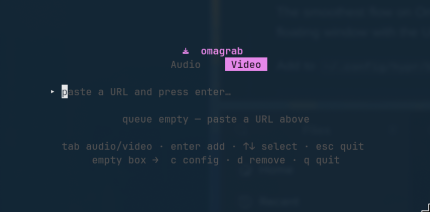

# omagrab

A fast, keyboard-driven **yt-dlp TUI** for [Omarchy](https://omarchy.org) — paste a
URL, pick Audio or Video, and watch it download with live progress. Built with Go +
[Bubble Tea](https://github.com/charmbracelet/bubbletea).

> **Omarchy only.** This is built specifically for Omarchy and isn't intended to be
> distro-portable. It relies on `xdg-terminal-exec`, Hyprland window rules,
> Wayland + `wl-clipboard`, and a Nerd Font terminal. There are no X11 /
> non-Omarchy fallbacks.

<p align="center">
  
</p>

## Features

- **Works with any [yt-dlp-supported site](https://github.com/yt-dlp/yt-dlp/blob/master/supportedsites.md)**
  — paste a link and go.
- **Dual mode** — `Tab` toggles ♪ Audio ↔ 🎬 Video.
- **Paste-and-queue** — drop in a URL, press `Enter`, keep adding. A worker
  downloads them one at a time with live progress, speed and ETA.
- **Audio** — extracts to your chosen format (opus / mp3 / m4a / flac) with
  metadata and thumbnail embedded, into your audio directory.
- **Video** — quality selector (best / 2160 / 1440 / 1080 / 720), merged to mp4,
  with optional English subtitles, into your video directory.
- **Config view** — change format, quality and subtitles inline; saved to
  `~/.config/omagrab/config.json`.
- **Clipboard launch** — `omagrab --clip` pre-fills the URL from your clipboard,
  perfect for a Hyprland keybind (see below).
- **Dependency check** — tells you exactly what to `pacman -S` if anything's missing.

## Requirements

- [yt-dlp](https://github.com/yt-dlp/yt-dlp)
- [ffmpeg](https://ffmpeg.org/) (for extraction, merging and embedding)
- `wl-clipboard` (only for the `--clip` / clipboard launch flow)

```bash
sudo pacman -S yt-dlp ffmpeg wl-clipboard
```

## Install

One line — pulls in `yt-dlp`, `ffmpeg` and `wl-clipboard` via pacman if they're
missing, installs the binary to `~/.local/bin`, and (on Omarchy) adds a Walker
entry plus the Hyprland rule that makes omagrab float small and centered:

```bash
curl -fsSL https://raw.githubusercontent.com/28allday/omagrab/main/install.sh | bash
```

Or from a clone (builds from source if Go is present, otherwise downloads the
latest released binary):

```bash
git clone https://github.com/28allday/omagrab.git
cd omagrab
./install.sh
```

Make sure `~/.local/bin` is on your `PATH`. On Omarchy it also wires up the
`SUPER+SHIFT+V` clipboard keybind (see below).

## Usage

```bash
omagrab            # open the TUI
omagrab <URL>      # open with a URL pre-filled
omagrab --clip     # open with the URL from your clipboard pre-filled
omagrab --help
```

### Keys

| Key            | Action                                            |
| -------------- | ------------------------------------------------- |
| `Tab`          | Switch Audio ↔ Video mode                         |
| `Enter`        | Add the URL in the box to the queue               |
| `↑` / `↓`      | Select a queue item                               |
| `c`            | Open config (when the URL box is empty)           |
| `d` / `x`      | Remove the selected item (when the box is empty)  |
| `q` / `Esc`    | Quit                                              |

In the config view: `↑↓` move, `←→` change a value, `Esc` saves and returns.

> Single-letter commands (`c`, `d`, `q`) only act when the URL box is empty — so
> they never get swallowed while you're typing or pasting a link.

## Clipboard keybind

The smoothest flow on Omarchy: **copy a link → `SUPER+SHIFT+V` → omagrab floats
with the URL ready → `Tab` to pick mode → `Enter`.**

The installer sets this up for you — it adds the `SUPER+SHIFT+V` keybind to
`~/.config/hypr/bindings.conf` and the floating window rule to
`~/.config/hypr/windows.conf`, then reloads Hyprland. Both are written between
clearly marked `omagrab` blocks (backed up first, never duplicated on re-run), so
they're easy to find, tweak or remove.

> If `SUPER+SHIFT+V` is already bound to something else, the installer leaves your
> shortcut alone and prints the line for you to add under a different key. Both the
> Walker entry and the keybind use the `omagrab` app-id, so the one window rule
> covers every launch path — edit its `size` line in `windows.conf` to resize.

## Configuration

`~/.config/omagrab/config.json`:

```json
{
  "audio_dir": "~/Music",
  "video_dir": "~/Videos",
  "audio_format": "opus",
  "video_quality": "best",
  "subtitles": false
}
```

Edit it directly, or change format / quality / subtitles from the in-app config
view (`c`). Directories support a leading `~`.

## A note on copyright

Please only download content you have the right to. That means your own uploads,
content released under a permissive licence (e.g. Creative Commons), public-domain
material, or anything you otherwise have permission to download. Downloading other
people's content without permission may be copyright infringement (in the UK this
can be a civil matter) and generally breaches the terms of service of the sites
involved. omagrab is a convenience wrapper around `yt-dlp`; how you use it is your
responsibility.

## License

[MIT](LICENSE) © 2026 Gavin Nugent
